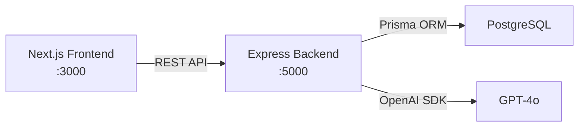
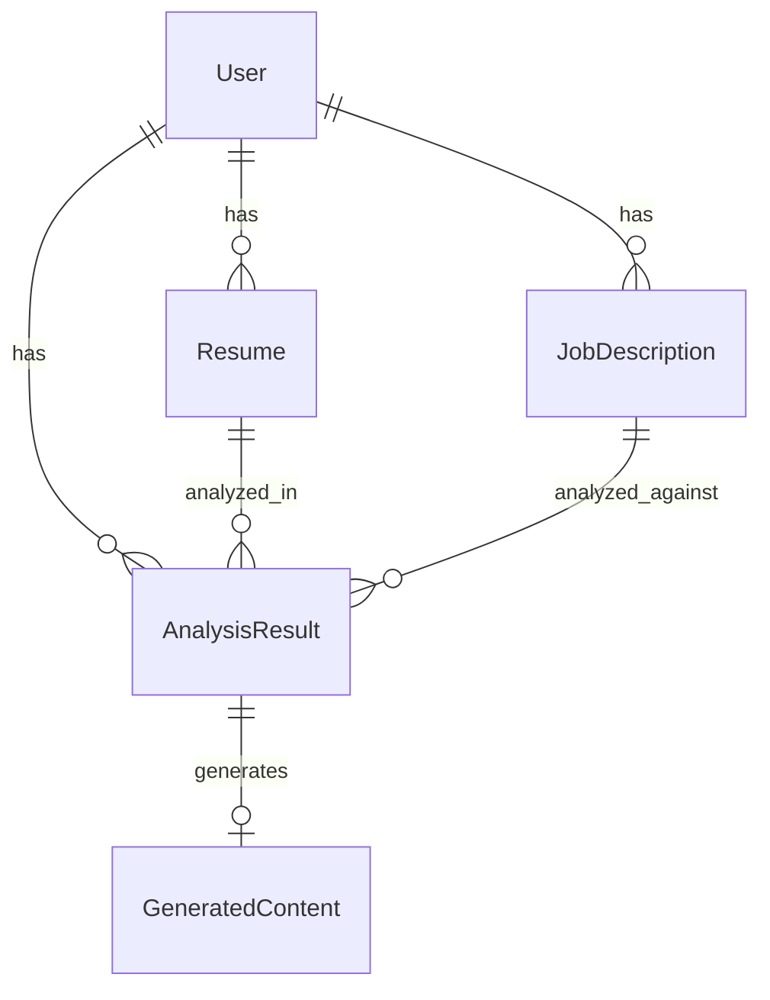

# AI Resume Tailor + Job Matcher — Walkthrough

## What Was Built

A complete full-stack AI-powered application with **38 source files** across two independent projects:

| Layer | Stack | Files |
|---|---|---|
| Backend | Express + TypeScript + Prisma + OpenAI | 20 files |
| Frontend | Next.js (App Router) + TypeScript + TailwindCSS | 18 files |

---

## System Architecture



### Key Design Decisions

| Decision | Rationale |
|---|---|
| **Separate FE/BE projects** | Independent deployability, clean API contract, backend can serve mobile/CLI clients |
| **AI logic isolated in `ai.service.ts`** | Single file to swap models, add caching, or change providers |
| **Zod for validation** | Type-safe request validation at the middleware layer, before controllers |
| **JWT in httpOnly cookies** | XSS-resistant token storage vs localStorage |
| **Prisma singleton** | Prevents connection pool exhaustion during dev hot-reload |
| **Fetch-based API client** | No axios dependency needed; native, typed, and tree-shakeable |

---

## Backend Structure

### File Map

```
backend/
├── prisma/schema.prisma           # 5 tables: User, Resume, JobDescription, AnalysisResult, GeneratedContent
├── src/
│   ├── server.ts                   # Express app bootstrap (CORS, JSON, cookies, routes, error handler)
│   ├── types/index.ts              # API-layer TypeScript interfaces
│   ├── utils/
│   │   ├── prisma.ts               # Singleton Prisma client
│   │   ├── openai.ts               # Singleton OpenAI client
│   │   └── logger.ts               # Winston structured logger
│   ├── middlewares/
│   │   ├── auth.middleware.ts       # JWT from cookie or Authorization header
│   │   ├── error.middleware.ts      # Global catch-all, sanitized in prod
│   │   └── validate.middleware.ts   # Zod schema → 400 with field-level errors
│   ├── services/
│   │   ├── ai.service.ts           # ALL OpenAI calls (analyze, cover letter, resume)
│   │   ├── resume.service.ts       # Resume CRUD
│   │   └── analysis.service.ts     # Orchestrates DB + AI for analysis/generation
│   ├── controllers/                # Thin: parse request → call service → format response
│   │   ├── resume.controller.ts
│   │   ├── analyze.controller.ts
│   │   ├── generate.controller.ts
│   │   └── history.controller.ts
│   └── routes/
│       ├── index.ts                # Route aggregator + health check
│       ├── resume.routes.ts
│       ├── analyze.routes.ts
│       ├── generate.routes.ts
│       └── history.routes.ts
├── .env                            # DATABASE_URL, OPENAI_API_KEY, JWT_SECRET, PORT
├── tsconfig.json
└── package.json
```

### API Route Map

| Method | Path | Auth | Description |
|---|---|---|---|
| GET | `/api/health` | ❌ | Health check |
| POST | `/api/resume/upload` | ✅ | Save resume text |
| GET | `/api/resume` | ✅ | List user's resumes |
| POST | `/api/analyze` | ✅ | AI match scoring + gap analysis |
| POST | `/api/generate/cover-letter` | ✅ | AI cover letter from analysis |
| POST | `/api/generate/resume` | ✅ | AI tailored resume from analysis |
| GET | `/api/history` | ✅ | All past analyses |

### Database Schema



---

## Frontend Structure

### File Map

```
frontend/src/
├── app/
│   ├── layout.tsx                  # Root: Inter font, navbar, background gradients, footer
│   ├── globals.css                 # Dark scrollbar, focus rings, animations
│   ├── page.tsx                    # Landing: hero, features grid, how-it-works
│   ├── analyze/page.tsx            # 3-step flow: upload → JD → results
│   ├── dashboard/page.tsx          # History list with loading/empty states
│   └── results/[id]/page.tsx       # Full analysis detail + generation
├── components/
│   ├── ui/
│   │   ├── Button.tsx              # Gradient primary, glass secondary, ghost, danger
│   │   ├── Card.tsx                # Glassmorphism container + sub-components
│   │   └── Badge.tsx               # Pill labels: success, warning, danger, info
│   ├── ResumeUploader.tsx          # Text area + file name + char counter
│   ├── JDInput.tsx                 # JD text + job title + company
│   ├── MatchScoreGauge.tsx         # Animated SVG circular gauge
│   ├── SkillsGap.tsx              # Missing skills badges + recommendation list
│   └── HistoryCard.tsx             # Compact analysis card for dashboard
├── services/api.ts                 # Centralized fetch client with typed endpoints
├── lib/
│   ├── utils.ts                    # cn(), formatDate, getScoreColor, truncate
│   └── constants.ts                # APP_NAME, NAV_LINKS, score labels
├── types/index.ts                  # Frontend TypeScript interfaces
└── .env.local                      # NEXT_PUBLIC_API_URL
```

---

## Verification Results

| Check | Result |
|---|---|
| `tsc --noEmit` (backend) | ✅ 0 errors |
| `prisma generate` | ✅ Generated client v5.9.1 |
| All 20 backend files created | ✅ |
| All 18 frontend files created | ✅ |

---

## How to Run

### Prerequisites
- **Node.js ≥ 20.9.0** (required by Next.js 16 and latest Prisma)
- **PostgreSQL** running locally or remotely

### Backend

```bash
cd backend

# 1. Update .env with your real credentials
#    DATABASE_URL, OPENAI_API_KEY, JWT_SECRET

# 2. Push schema to database
npx prisma db push

# 3. Start dev server
npm run dev
# → http://localhost:5000/api/health
```

### Frontend

```bash
cd frontend

# Start dev server
npm run dev
# → http://localhost:3000
```

> [!IMPORTANT]
> Your current Node.js version is **18.16.0**. Next.js 16 and latest Prisma require **Node ≥ 20.9.0**. Upgrade Node before running the dev servers:
> ```bash
> # Using n (already installed)
> sudo n 20
> # Or using nvm
> nvm install 20 && nvm use 20
> ```
